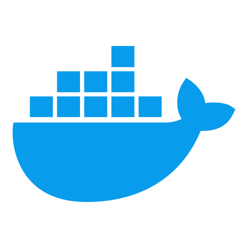
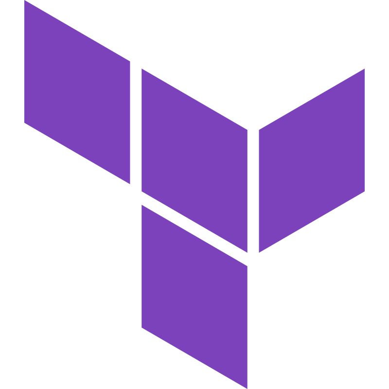

  

  

🏢 I am currently working as a Software Engineer at [blockben](https://blockben.com/), on a blockchain-based neobank. 🎓 Studied Software Engineering at [University of Debrecen](https://unideb.hu/en); 🏡 Lives in **Hungary** 

🔍 With a versatile background, I bring hands-on experience across multiple domains:
- 💳 Fintech: Innovating secure payment solutions and digital banking tools.
- ⚡ Smart Energy: Contributing to sustainable energy management projects.
- 🛒 Ecommerce: Developing scalable, user-friendly online shopping platforms.
- 📱 Mobile Development: Crafting responsive and feature-rich mobile applications.
- 💻 Web Development: Building modern, responsive websites and web apps.

<h3 align="center">
  stack
</h3>

<h4 align="center">
  programming languages and react
</h4>

  
  
  
  
  

 

<h4 align="center">
  devops
</h4>

  
  
  
  
  

 

<h4 align="center">
  databases
</h4>

  
  

 

  
  

  

  

